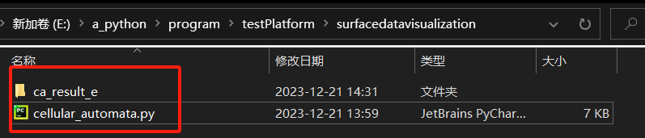
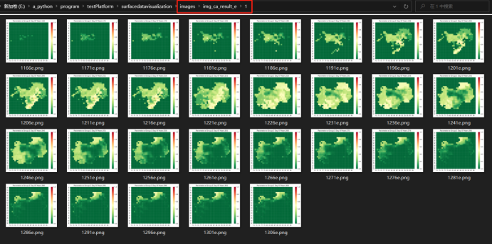
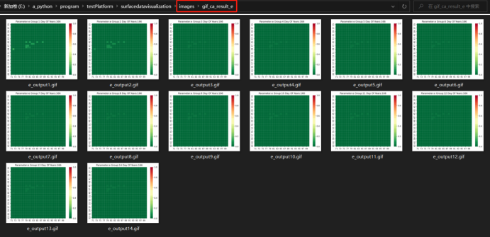
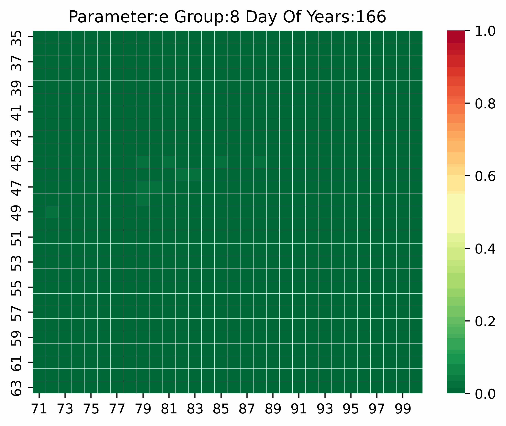
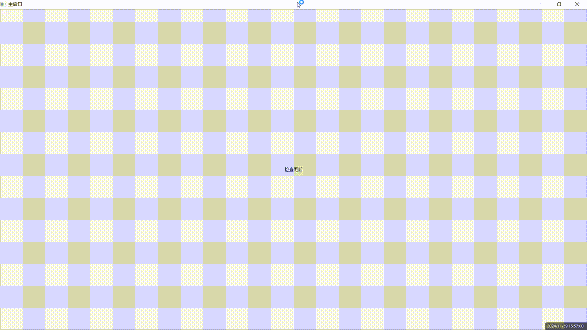
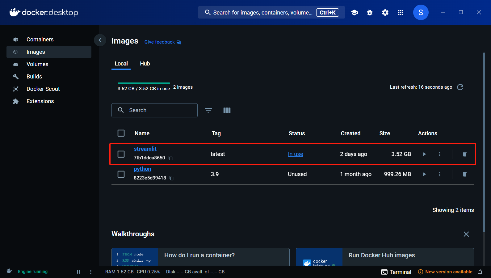
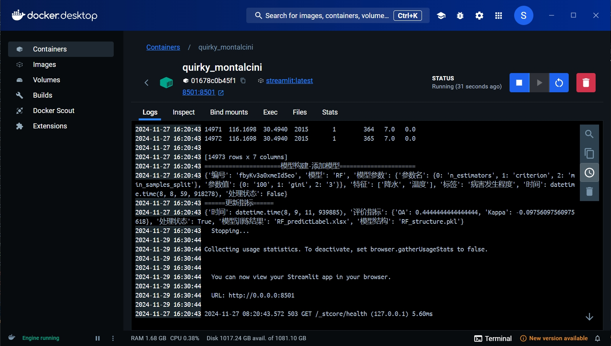
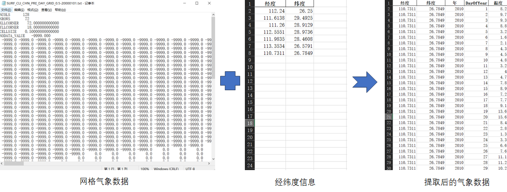
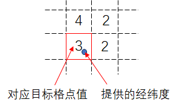

自用代码，包含各类小工具

# 1.面状数据可视化-以元胞自动机为例

## 功能描述

根据用户输入的面状数据和选取的显示区域范围，该模块可以自动生成以热力图形式的可视化结果，以展示某个区域内作物的发病情况。同时，还合成了每一组结果数据内多天的热力图，以GIF图的形式动态展示多天变化的效果，让用户更直观地感受病害发展的变化过程。

## Python版本及依赖环境要求

Python>=3.7  
matplotlib==3.5.3  
pandas==1.3.5  
seaborn==0.12.2  
tqdm==4.65.0  
pillow==9.4.0  

## 输入

1）面状数据文件夹名称  
2）截取区域范围（最小行、最大行、最小列、最大列）

## 输出

1）单个参数的多天多组的单张热力图  
2）单个参数的由多天合成后的多组热力图

## 操作说明

1）将输入的面状数据文件夹和cellular_automata.py代码文件放在同一目录下,如下图所示    
2）安装项目所需的第三方库  
3）初始化设置参数,包括面状数据文件夹名称和显示区域范围  
4）运行cellular_automata.py  


## 注意事项

1）输入面状数据文件格式必须为excel格式（.xlsx ,.xls），并将这些文件放在一个文件夹中  
2）输入面状数据的文件夹名称格式必须为'自定义'+'_'+模型输出参数名称,例如ca_result_e  
3）如需读取多个模型参数的面状数据，可以在以下初始化参数设置代码中，将需要输入的面状数据文件夹名称添加在数组中

``` Python
dataDirNameTempList = ['ca_result_e', '面状数据文件夹名称2', ''面状数据文件夹名称3']
```

4）输出的所有原始热力图和合成后的GIF图文件会自动保存在同级目录下的images文件夹中  
5）在面状数据表格中，若数值以1作为填充值（例如参数s的生成数据），程序自动将热力图的色带倒转，数值1对应绿色，数值0对应红色，使得整体颜色效果呈现由绿到红的渐变  
6）目前excel截取区域范围设置为38, 60, 71, 100，其他区域范围尚未进行测试，可能会造成热力图中Y轴坐标刻度的显示错误和显示区域未居中等问题

## 其他

后续改进：寻找并使用专业的格式清晰的文档注释来规范和改善该模块内容，同时，对于代码部分，可开放多个输入参数的设置，例如热力图色带的选择，热力图像素大小等，使得模块功能更通用，提高用户的可操作性

## 结果展示

在该目录中的ca_result_e和images文件夹为示例数据




# 2.基于PYQT信号与槽的多线程实现方式

## 功能描述

基于多线程编程方式，实现自动从URL下载文件的同时，可以更新UI界面进度条和在文本框输入文字，解决基于单线程实现程序时，界面处理其他操作后出现无响应问题

## 关键代码

1）progressSignal = pyqtSignal()  
2）self.progressSignal.emit()  
3）self.download_thread.start()  
4）self.download_thread.progressSignal.connect()  

## 结果展示



# 3.基于Docker的系统部署

## 功能描述

利用Docker部署基于Streamlit搭建的Web系统

## 操作流程

1）添加Dockerfile文件  
2）设置具体参数(详细参考Dockerfile文件)  
3）命令行输入Docker指令打包镜像:docker build ./myproject -t streamlit  
4）命令行输入Docker指令运行镜像:docker run -p 8501:8501 streamlit  

## 结果展示




# 4.面向网格数据的气象因子提取

## 功能描述
	
针对国家气象科学数据中心[1]提供的网格气象数据（0.5°×0.5°），根据指定经纬度信息，匹配对应格点数据，从而批量提取并转化为目标地区excel格式的气象数据

## 方法

1）利用rasterio将ASCII转换栅格  
2）通过整数除法找到指定经纬度所在的栅格位置并获取值  
lon_index = int ((lon - adfGeoTransform[0]) / adfGeoTransform[1])  
lat_index = int ((lat - adfGeoTransform[3]) / adfGeoTransform[5])  


## 依赖环境版本
 
GDAL==3.8.2  
rasterio==1.3.10  

## 操作流程

用户输入包含经纬度信息的excel文件，系统自动根据经纬度匹配网格气象数据，以excel文件格式输出提取后的气象数据  
注意:系统会自动创建2个文件夹存放过程文件，1个提取后的结果excel文件
1. 自定义文件名(如uploadFile.xlsx):上传含经纬度信息的excel文件
2. rasterFile:由ASCII转换的栅格数据
3. excelFile:由栅格数据转换的excel数据
4. result.xlsx:提取后的结果excel文件

## 参考文献

[1]赵煜飞,朱江,许艳. 近50a中国降水格点数据集的建立及质量评估[J]. 气象科学,2014,34(4):414-420. DOI:10.3969/2013jms.0008.